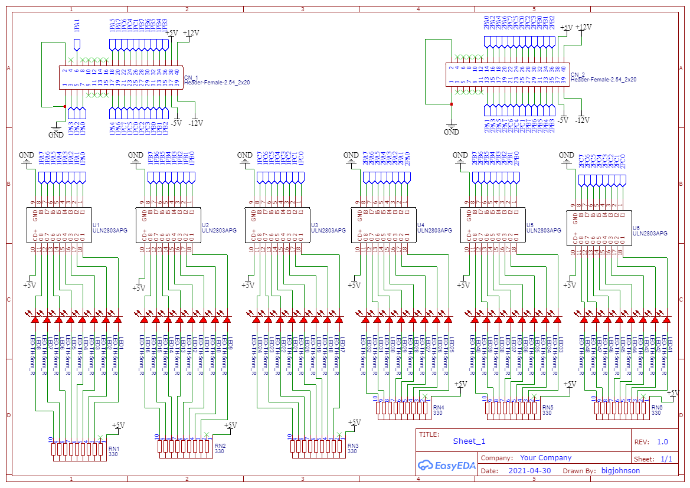
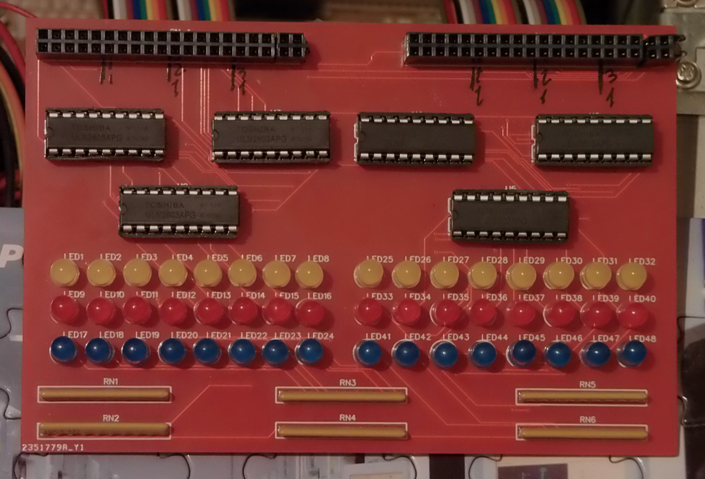

Here you will find a breakout board with led and drivers.

The breakout is connected with cables to FPC-014

Json files are in Easyeda format

RN1 to RN6 are 330 Hom 10 pin resistors network.

The chips are ULN2803APG eight array darlinghton.

